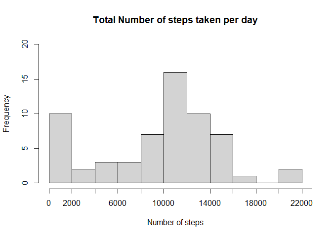
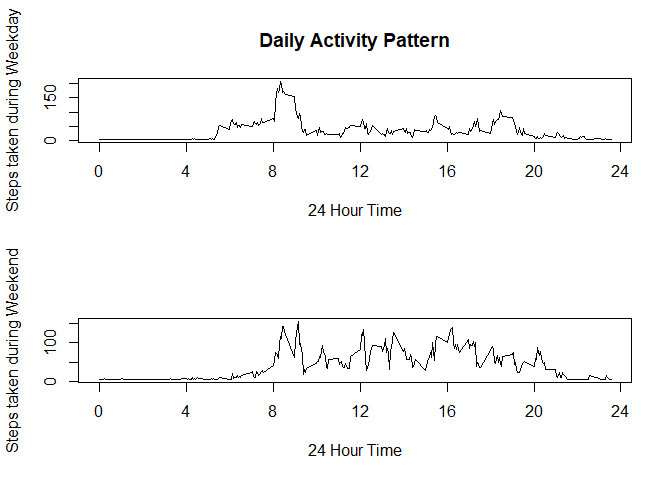

## Loading and preprocessing the data
### Extract the data out from CSV file

```r
setwd("C:/Users/User/Desktop/Studies/Data Science/Part 6/RepData_PeerAssessment1")
data <- read.csv("activity.csv")
```

### Load the Necessary library in the assignment

```r
library(lubridate)
```

```
## 
## Attaching package: 'lubridate'
```

```
## The following objects are masked from 'package:base':
## 
##     date, intersect, setdiff, union
```

```r
library(dplyr)
```

```
## 
## Attaching package: 'dplyr'
```

```
## The following objects are masked from 'package:stats':
## 
##     filter, lag
```

```
## The following objects are masked from 'package:base':
## 
##     intersect, setdiff, setequal, union
```

## What is mean total number of steps taken per day?
### Histogram of the total number of steps taken each day

```r
#Transform date to ymd format with lubridate
data$date <- ymd(data$date)

# Calculate the number of step per day and histogram
total <- tapply(data$steps,data$date,FUN=sum,na.rm=T)
hist(total,
     main = "Total Number of steps taken per day",
     xlab = "Number of steps",
     breaks = 10,
     ylim = c(0,20),
     xaxt = 'n')
axis(side=1,at=seq(0,25000,2000))
```

<!-- -->

### Mean and median number of steps taken each day

```r
mean <- mean(total,na.rm=T)
mean
```

```
## [1] 9354.23
```

```r
median <- median(total,na.rm=T)
median
```

```
## [1] 10395
```

## What is the average daily activity pattern?
### Time series plot of the average number of steps taken

```r
# Convert to interval to time
data <- data %>% mutate(interval = interval*100)
data$time <- sprintf("%06d",data$interval)

# Average step taken across days in each 5 minute
average <- tapply(data$steps,data$time,mean,na.rm=T)

# Plot time series plot
plot(unique(data$time),average,type="l",
     main = "Daily Activity Pattern",
     ylim = c(0,230),
     ylab = "Average number of steps taken",
     xlab = "24 Hour Time",
     xaxt = 'n')
axis(side=1,at=seq(0,240000,40000),labels=seq(0,24,4))
```

<!-- -->

### 5 minute interval that contain the max number of step

```r
# Maximum step among the 5 minute interval
max <- unique(data$time)[which.max(average)]
max
```

```
## [1] "083500"
```

## Imputing missing values
### Imputing missing data with average value divided by 5 minute interval in a day

```r
# Imputing Missing Value by using mean value for the day
numberNA <- sum(is.na(data$steps))
data[is.na(data)] = mean/(24*60/5)
data2 <- data
```

### Histogram of total number step after missing value are imputed

```r
# Histogram with imputed NA value
total2 <- tapply(data2$steps,data2$date,FUN=sum,na.rm=T)
hist(total2,
     main = "Total Number of steps taken per day",
     xlab = "Number of steps",
     breaks = 10,
     ylim = c(0,20),
     xaxt = 'n')
axis(side=1,at=seq(0,25000,2000))
```

<!-- -->

### Mean and median number of steps taken each day for imputed dataset

```r
# Mean and Median of Total step per day 
mean2 <- mean(total2,na.rm=T)
mean2
```

```
## [1] 10581.01
```

```r
median2 <- median(total2,na.rm=T)
median2
```

```
## [1] 10395
```

## Are there differences in activity patterns between weekdays and weekends?
### Create factor for weekend and weekday

```r
# Create factor variable with weekday or weekend level
data2$weekday <- weekdays(data2$date)
data2$weekend <- ifelse(data2$weekday %in% c("Saturday","Sunday"),"Weekend","Weekday")
data2$weekend <- as.factor(data2$weekend)
```

### Panel plot comparing average number of steps taken per 5 minute interval across weekdays and weekends

```r
# Average step taken across days in weekend and weekdays
average2 <- with(data2[data2$weekend == "Weekday",],tapply(steps,time,mean))
average3 <- with(data2[data2$weekend == "Weekend",],tapply(steps,time,mean))

# Panel Plot time series plot with weekend and weekday
par(mfrow=c(2,1))
plot(unique(data2$time),average2,type="l",
     ylab = "Steps taken during Weekday",
     xlab = "24 Hour Time",
     xaxt = 'n')
axis(side=1,at=seq(0,240000,40000),labels=seq(0,24,4))
title(main = "Daily Activity Pattern")

plot(unique(data2$time),average3,type="l",
     ylab = "Steps taken during Weekend",
     xlab = "24 Hour Time",
     xaxt = 'n')
axis(side=1,at=seq(0,240000,40000),labels=seq(0,24,4))
```

<!-- -->


